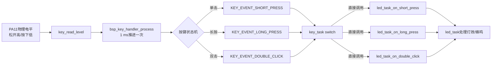
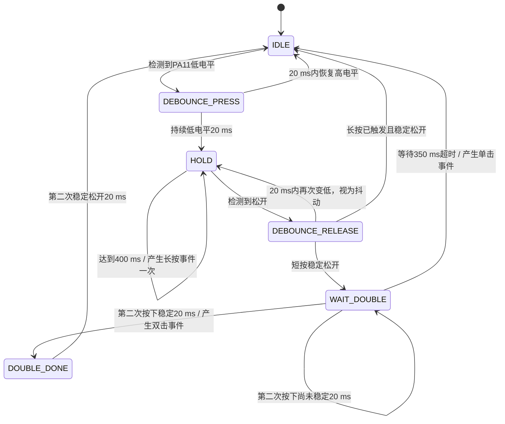
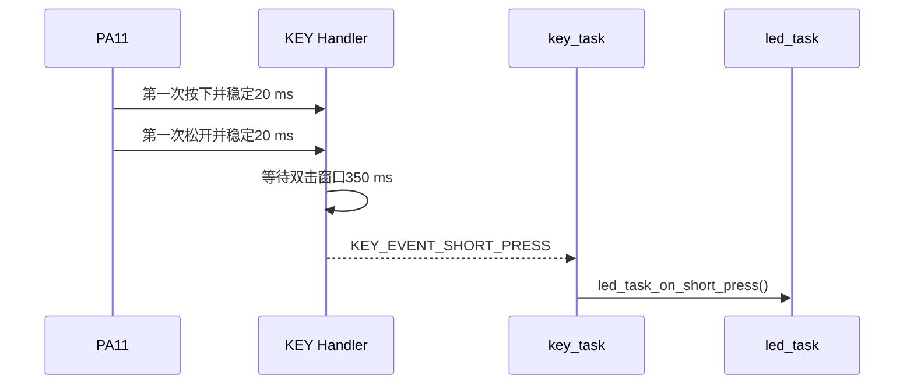
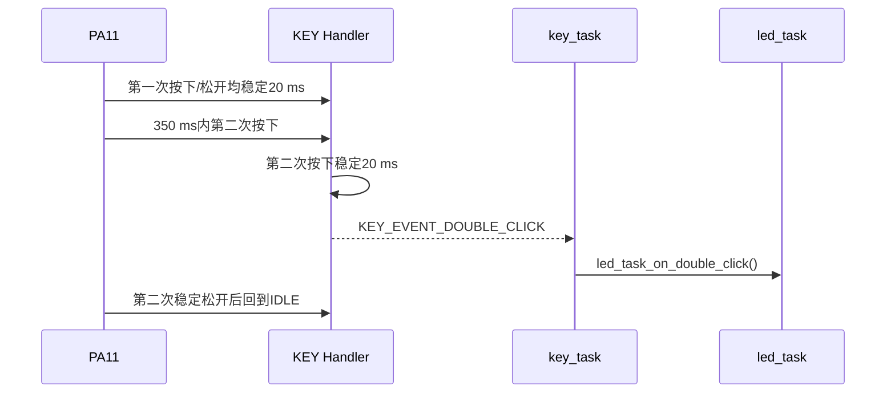
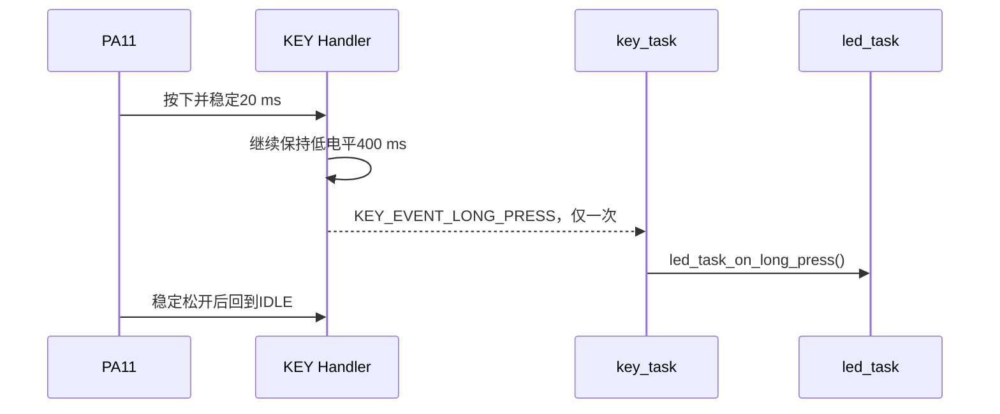
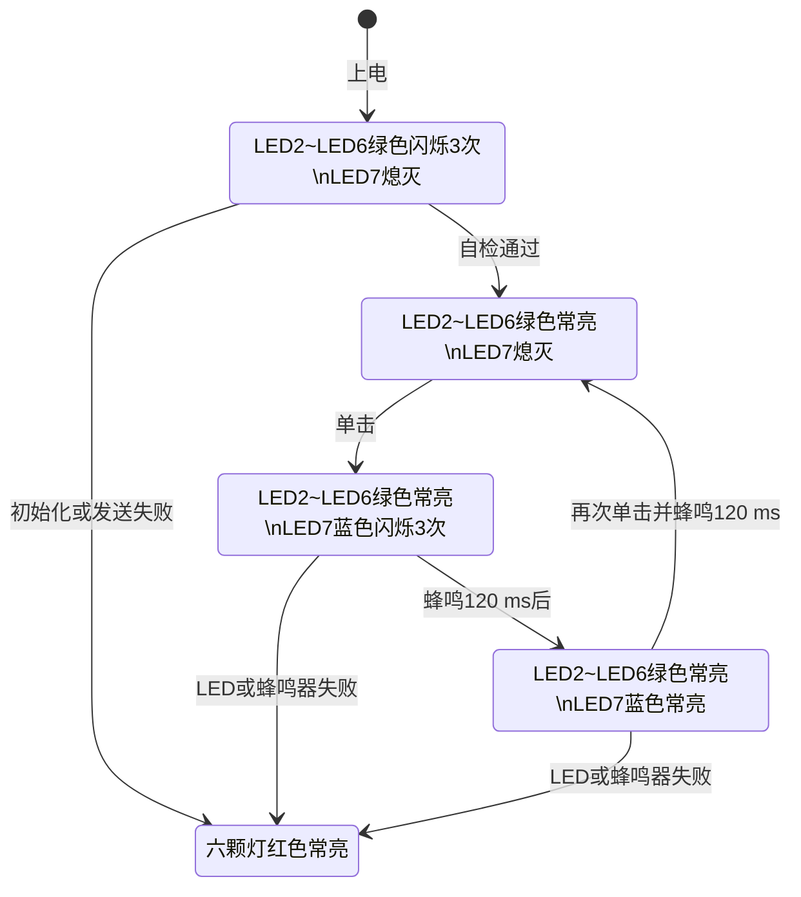

# 06 按键与LED逻辑链路

> 历史说明：本文的灯效和按键状态机仍可用于理解业务；“不使用Task Notification”的传递方式已被替代，当前链路以 `10_按键任务通知_软件接口与Agent日志说明.md`为准。

## 1. 按键完整调用链

这里没有FreeRTOS Task Notification。按键任务直接调用LED任务对外接口；接口快速记录动作后立即返回，耗时动作仍在LED任务中运行，避免阻塞1 ms按键扫描。

## 2. 按键状态机

### 单击时间链

### 双击时间链

### 长按时间链

## 3. LED物理映射

SK6805数据先到LED7，再依次到LED6、LED5、LED4、LED3、LED2：

| 业务对象 | 灯号 | 发送缓存序号 |
|---|---:|---:|
| 系统状态 | LED7 | 0 |
| 相机5 | LED6 | 1 |
| 相机4 | LED5 | 2 |
| 相机3 | LED4 | 3 |
| 相机2 | LED3 | 4 |
| 相机1 | LED2 | 5 |

鱼眼相机当前不设置独立指示灯。

## 4. LED主状态逻辑

## 5. 灯效与需求表逐项对应

| 状态 | LED2~LED6 | LED7 | 蜂鸣器 |
|---|---|---|---|
| 上电自检 | 绿色闪烁 | 熄灭 | 关闭 |
| 待机 | 绿色常亮 | 熄灭 | 关闭 |
| 数采准备 | 绿色常亮 | 蓝色闪烁 | 暂不鸣叫 |
| 开始采集 | 绿色常亮 | 蓝色常亮 | 切换前短鸣120 ms |
| 故障 | 红色常亮 | 红色常亮 | 关闭 |

黄色状态未实现。长按和双击的临时识别反馈结束后，会恢复进入反馈前的待机或采集显示，不改变LED主状态。
